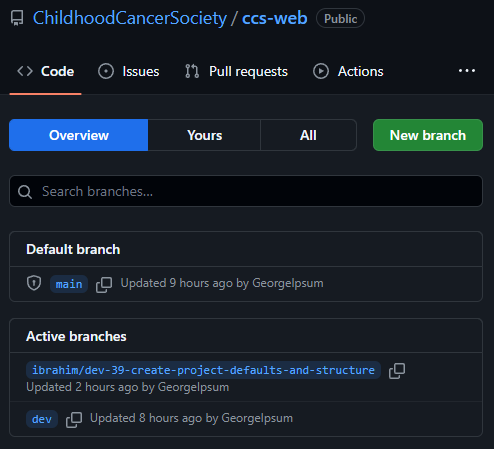
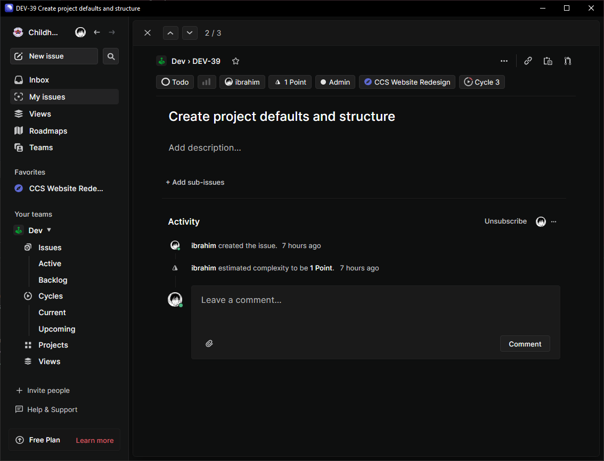
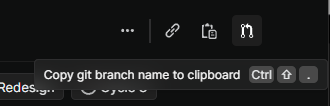
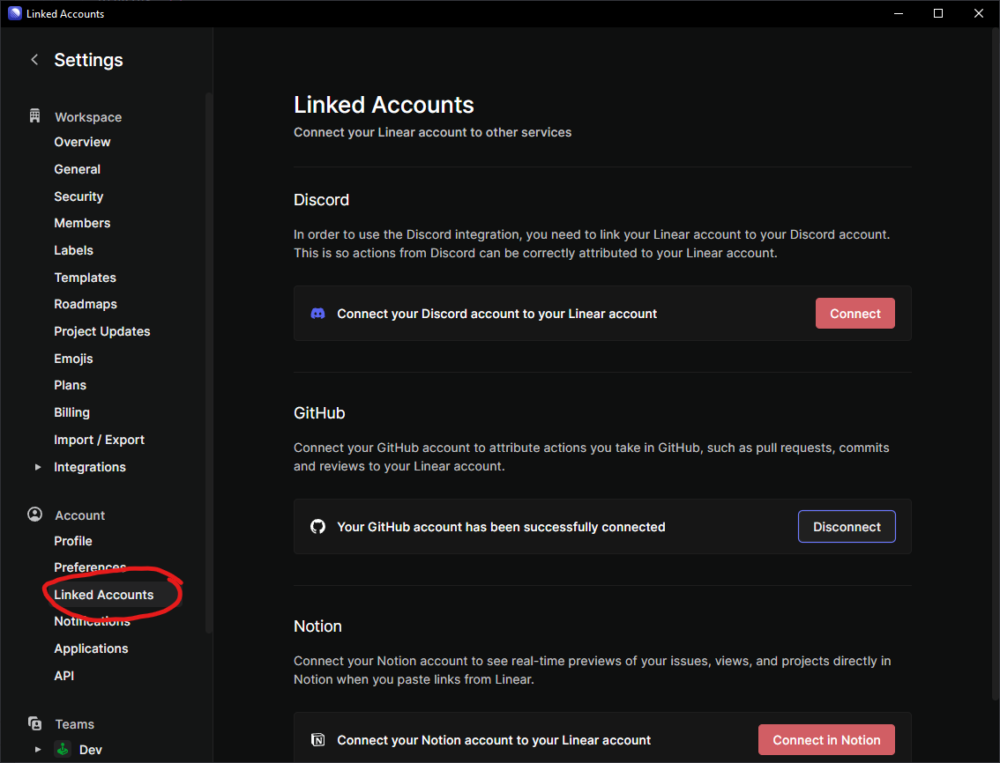

# Git Workflow @CCS

## The `dev` branch

Hi all! Our model will be mostly similar to GitHub's own [GitHub flow](https://docs.github.com/en/get-started/quickstart/github-flow), with a couple of key distinctions. The `main` branch in each repo (the one you're on by default when cloning the project) will be reserved for deploying updates. Development will happen on the `dev` branch, and we'll be branching off of `dev` for individual issues, usually based on Linear's syntax.

If you haven't already, make sure your local repo is on the `dev` branch (make sure you are on the root `ccs-web` folder and not one of the subfolders):
```bash
git checkout dev
```

Just like in GitHub flow, individual contributions are made through simply branching off of `dev`, creating a pull request (more on this later), and finally merging back into `dev` after code review.

## Creating branches through our flow

In the [`ccs-web` repo](https://github.com/ChildhoodCancerSociety/ccs-web), you can see there are currently 3 branches:



The 2nd branch in the `ccs-web` repo, `ibrahim/dev-39-create-project-defaults-and-structure`, is an example of a branch created to accomplish [a specific Linear task](https://linear.app/childhood-cancer-society/issue/DEV-39/create-project-defaults-and-structure):



In the upper right hand corner of the task, you can see 3 icons. The rightmost one when hovering over it will tell you that it will copy a git branch name to your clipboard (the keyboard shortcut for this on Windows is `CTRL+SHIFT+.`, `CMD+SHIFT+.` on macos):



Doing this simplifies branch conventions and also allows Linear to automatically track the progress of your issue through this branch on GitHub. In order for the latter to work however you must also link Linear to your personal GitHub account:



This isn't necessary by any means, but it will definitely make administration a lot easier.

For those of you familiar with Git, you can skip to the next section.

After copying the branch name, you can create the branch locally and then also push it to the remote:
```bash
git checkout -b ibrahim/dev-39-create-project-defaults-and-structure
git push --set-upstream origin ibrahim/dev-39-create-project-defaults-and-structure
```

We can break both of these down.

`git checkout` is used to move the repo to somewhere in the git tree. The `-b` flag specifies that you're creating a new branch, and finally `ibrahim/dev-39-create-project-defaults-and-structure` is input for the name of the new branch. For the second command, `git push` is used to push local commits to the remote (in this case GitHub). The `--set-upstream` flag (which is now aliased to the better named `--set-upstream-to`) sets the default remote branch for pushing/ pulling on the git repository you specify and then local branch you specify. In this case, `origin` refers to the remote git repository that we've cloned, and `ibrahim/dev-39-create-project-defaults-and-structure` is the local branch that we also want to be able to push and pull to from remote.

Finally, the `--set-upstream` flag is a little verbose, so you can actually shorten it to `-u` if you want.

After doing this, local commits on your machine can be pushed to the remote on GitHub via `git push` and they will appear on your new branch on GitHub as well.

## PRs

Once you feel like you've made good progress on your task, you can draft a pull request on GitHub (or in your editor if you have some GitHub plugin):


If you've linked your GitHub account, new PRs using a task's branch name from Linear will change that task to "In Progress" automatically and link the PR:


From here, we can either do a code review async or discuss your PR at the next standup. Once the PR has been approved, we'll merge your branch back into `dev` and we can then delete the branch.

Once we've tested changes more rigorously, we can deploy them by merging the `dev` branch back into `main`. CI/CD will come in the next couple of weeks but we will be relying on it heavily to get our applications off the ground.

That's it for our git workflow! Please let me know if you have any questions.